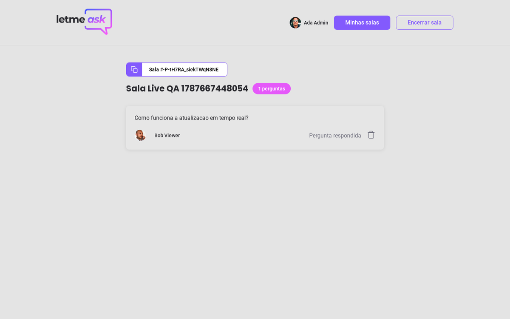
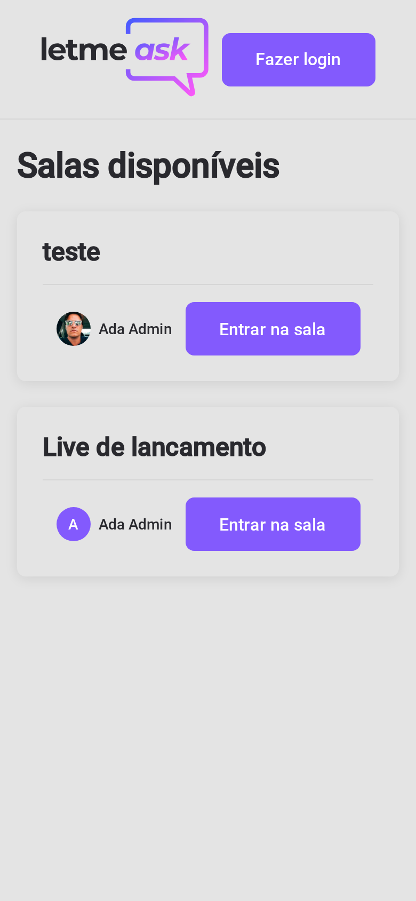
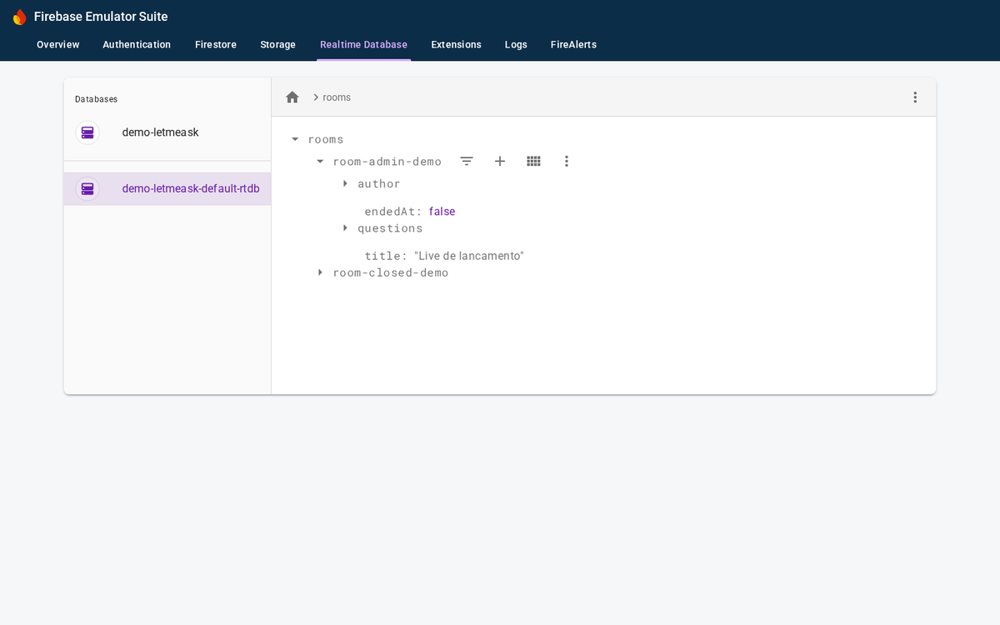
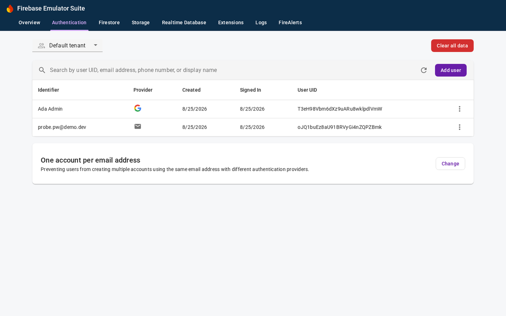

# Let Me Ask

Real-time Q&A rooms for live streams and presentations: the speaker creates a
room, the audience joins with a code, asks questions and upvotes the ones that
should be answered first. Originally built during
[Rocketseat NLW #6 Together](https://rocketseat.com.br) (June 2021), restored
and modernized in 2026 on Node 22 with every dependency current.


## The audience experience

Anyone with the room code follows the Q&A live: questions appear in real time,
the highlighted one shows a pin badge while it is being answered and answered
questions get their own badge. Likes decide what the speaker reads next.


- Google sign-in through Firebase Authentication
- Ask questions with inline validation (react-hook-form + zod)
- Like and unlike any open question, one like per person enforced by security rules
- Real-time badges for highlighted and answered questions

## The speaker cockpit

The room owner gets a moderation panel: highlight the question being answered,
mark it as done, remove noise and close the room when the stream ends. The
audience is redirected home the moment the room closes.

| Moderation controls | Highlighted and answered states |
|---|---|
|  |  |

- Highlight the question being answered right now
- Mark questions as answered, remove questions
- Close a room for good; the audience is sent home automatically
- Reopen a closed room later from the management page

## Discovery and management

Public open rooms are browsable, your own rooms have a management page, and
joining by code validates against the database with friendly inline errors.

| Room discovery | My rooms | Home |
|---|---|---|
|  |  |  |

- Browse open public rooms (closed ones stay private)
- Join by code with inline "not found" and "already closed" errors
- Manage your rooms: reopen or delete

## Fully usable on mobile

The layout collapses to a single column: the header stacks, room codes
truncate, cards wrap and the hero illustration steps aside on small screens.

<p>
  
  
  
</p>

## Tech stack

| Layer | Tools |
|---|---|
| Language | TypeScript (strict, TS 7) |
| UI | React 19, react-router-dom 7, Sass, classnames |
| Forms | react-hook-form + zod resolver |
| Backend | Firebase 12 modular SDK: Google Auth + Realtime Database with security rules |
| Tooling | Vite 8 (Rolldown), Firebase Emulator Suite for offline sandbox |

## Concepts demonstrated

- Realtime data flow with Firebase Realtime Database listeners (`onValue`) and cleanup on unmount
- Firebase security rules: owner-only writes, question creation only in open rooms, like ownership validation (`database.rules.json`)
- Auth state restoration race handling (guard routes only after auth resolves)
- Typed environment variables through Vite `ImportMetaEnv`
- Single path alias (`@/`) with strict `verbatimModuleSyntax` type-only imports
- Schema validation on forms with zod and react-hook-form resolvers
- Offline-first development against the Firebase Emulator Suite (auth + database)

## How to run

Requirements: Node.js 22+ (`.nvmrc` provided) and Java 21+ only for the sandbox mode.

### With your own Firebase project

```bash
npm install
cp .env.example .env    # paste the 7 values from Firebase console (VITE_* names)
npm run dev             # http://localhost:5173
```

In the Firebase console: create a project, enable Google as a sign-in provider,
create a Realtime Database and publish the contents of `database.rules.json`.

### Offline sandbox (no Firebase project needed)

```bash
npm run sandbox   # starts Auth (9099) and Realtime Database (9000) emulators
npm run dev       # with VITE_USE_EMULATORS="true" in .env
```

The app detects `VITE_USE_EMULATORS="true"` and attaches to the local
emulators. Sign in with any account through the emulator popup window.
Security rules run inside the emulator too: writes without a matching owner
or an authenticated session are rejected exactly like in production.

| Emulator Suite UI: Realtime Database | Emulator Suite UI: Authentication |
|---|---|
|  |  |

### Quality gates

```bash
npm run typecheck
npm run build
```

The full user journey (sign-in, create room, ask, like, highlight, answer,
close, reopen, delete) is exercised by a Playwright suite against the
emulators; see the roadmap below.

## Roadmap

- [x] Restore on Node 22, migrate CRA to Vite, Firebase 8 to 12 modular, React 17 to 19, Router 5 to 7
- [x] Fix security rules (owner path mismatch, list reads) and auth race on the admin route
- [x] Forms validated with react-hook-form + zod
- [x] Offline sandbox with Firebase Emulator Suite
- [x] Responsive layout for mobile (no horizontal overflow, single column grids)
- [ ] Promote the Playwright journey into a committed test suite (currently a local script) and add unit tests: known debt
- [ ] Paginate room discovery with indexed queries instead of full-list reads
- [ ] Toasts to replace `window.confirm` dialogs

## License

[MIT](LICENSE)

## Author

Built by [Tiago Gonçalves de Castro](https://github.com/tiagogcastro)
· [LinkedIn](https://www.linkedin.com/in/tiagogcastro)
