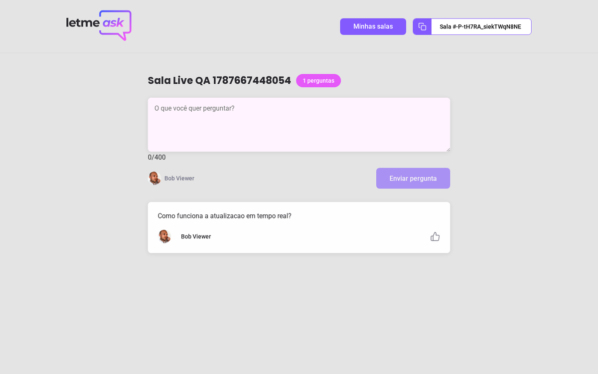
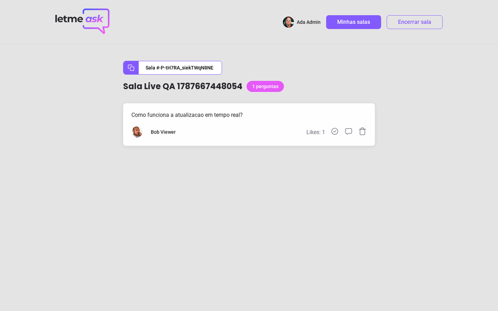
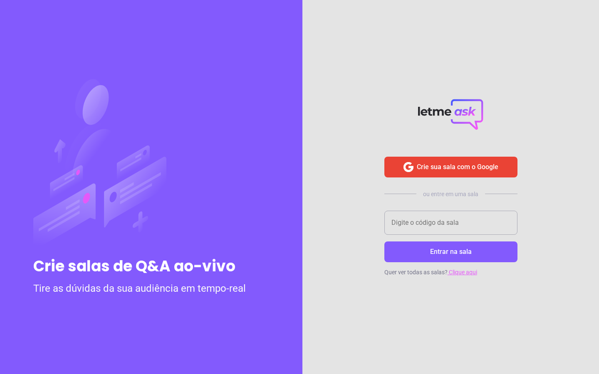
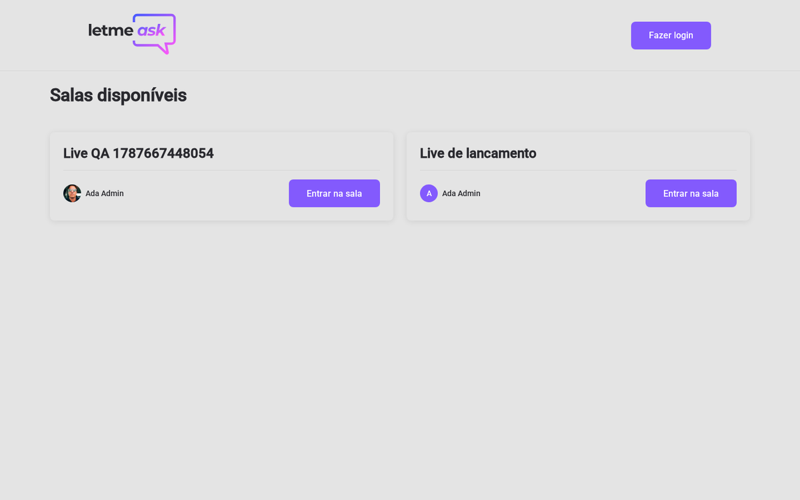
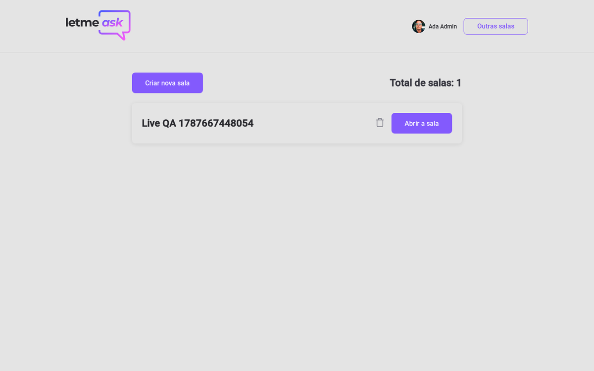
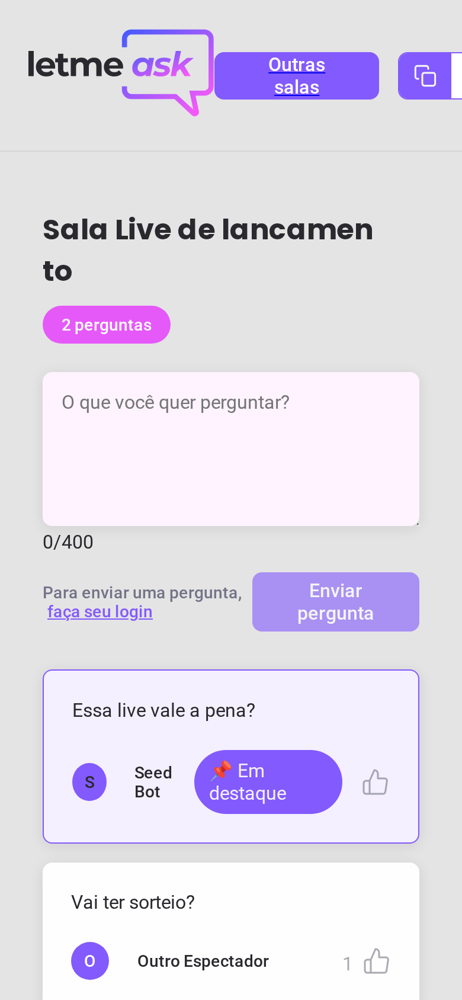

# Let Me Ask

Real-time Q&A rooms for live streams and presentations: the speaker creates a
room, the audience joins with a code, asks questions and upvotes the ones that
should be answered first. Originally built during
[Rocketseat NLW #6 Together](https://rocketseat.com.br) (June 2021), restored
and modernized in 2026 on Node 22 with every dependency current.



| Audience room | Speaker moderation |
|---|---|
|  |  |

| Home | Room discovery | My rooms |
|---|---|---|
|  |  |  |

<p>
  
  
</p>

## Features

- Google sign-in through Firebase Authentication
- Create rooms and share them by code or URL
- Audience view: ask questions, like questions, see highlighted and answered badges in real time
- Speaker room: highlight the question being answered, mark it as answered, remove it
- Room management: reopen or delete your own rooms, close a room for good
- Room discovery: browse open public rooms, join by code with inline validation

## Tech stack

| Layer | Tools |
|---|---|
| Language | TypeScript (strict, TS 7) |
| UI | React 19, react-router-dom 7, Sass, classnames |
| Forms | react-hook-form + zod resolver |
| Backend | Firebase 12 modular SDK: Google Auth + Realtime Database with security rules |
| Tooling | Vite 8 (Rolldown), Firebase Emulator Suite for offline sandbox |

## Concepts demonstrated

- Realtime data flow with Firebase Realtime Database listeners (`onValue`) and cleanup on unmount
- Firebase security rules: owner-only writes, question creation only in open rooms, like ownership validation (`database.rules.json`)
- Auth state restoration race handling (guard routes only after auth resolves)
- Typed environment variables through Vite `ImportMetaEnv`
- Single path alias (`@/`) with strict `verbatimModuleSyntax` type-only imports
- Schema validation on forms with zod and react-hook-form resolvers
- Offline-first development against the Firebase Emulator Suite (auth + database)

## How to run

Requirements: Node.js 22+ (`.nvmrc` provided) and Java 21+ only for the sandbox mode.

### With your own Firebase project

```bash
npm install
cp .env.example .env    # paste the 7 values from Firebase console (VITE_* names)
npm run dev             # http://localhost:5173
```

In the Firebase console: create a project, enable Google as a sign-in provider,
create a Realtime Database and publish the contents of `database.rules.json`.

### Offline sandbox (no Firebase project needed)

```bash
npm run sandbox   # starts Auth (9099) and Realtime Database (9000) emulators
npm run dev       # with VITE_USE_EMULATORS="true" in .env
```

The app detects `VITE_USE_EMULATORS="true"` and attaches to the local
emulators. Sign in with any account through the emulator popup window.

### Quality gates

```bash
npm run typecheck
npm run build
```

The full user journey (sign-in, create room, ask, like, highlight, answer,
close, reopen, delete) is exercised by a Playwright suite against the
emulators; see the roadmap below.

## Roadmap

- [x] Restore on Node 22, migrate CRA to Vite, Firebase 8 to 12 modular, React 17 to 19, Router 5 to 7
- [x] Fix security rules (owner path mismatch, list reads) and auth race on the admin route
- [x] Forms validated with react-hook-form + zod
- [x] Offline sandbox with Firebase Emulator Suite
- [ ] Promote the Playwright journey into a committed test suite (currently a local script) and add unit tests: known debt
- [ ] Paginate room discovery with indexed queries instead of full-list reads
- [ ] Toasts to replace `window.confirm` dialogs

## License

[MIT](LICENSE)

## Author

Built by [Tiago Gonçalves de Castro](https://github.com/tiagogcastro)
· [LinkedIn](https://www.linkedin.com/in/tiagogcastro)
